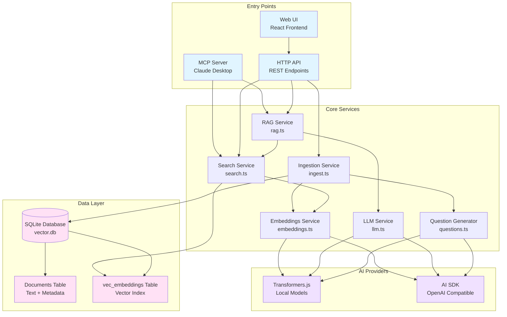
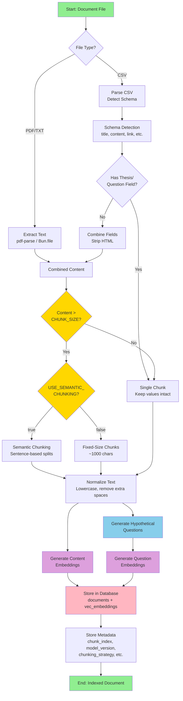
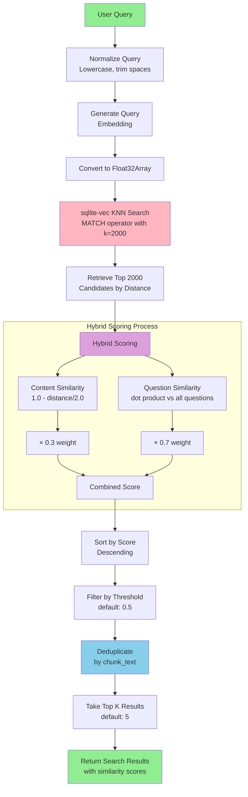
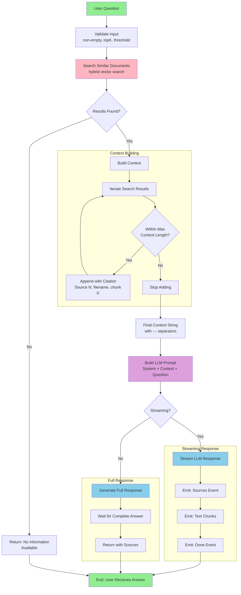
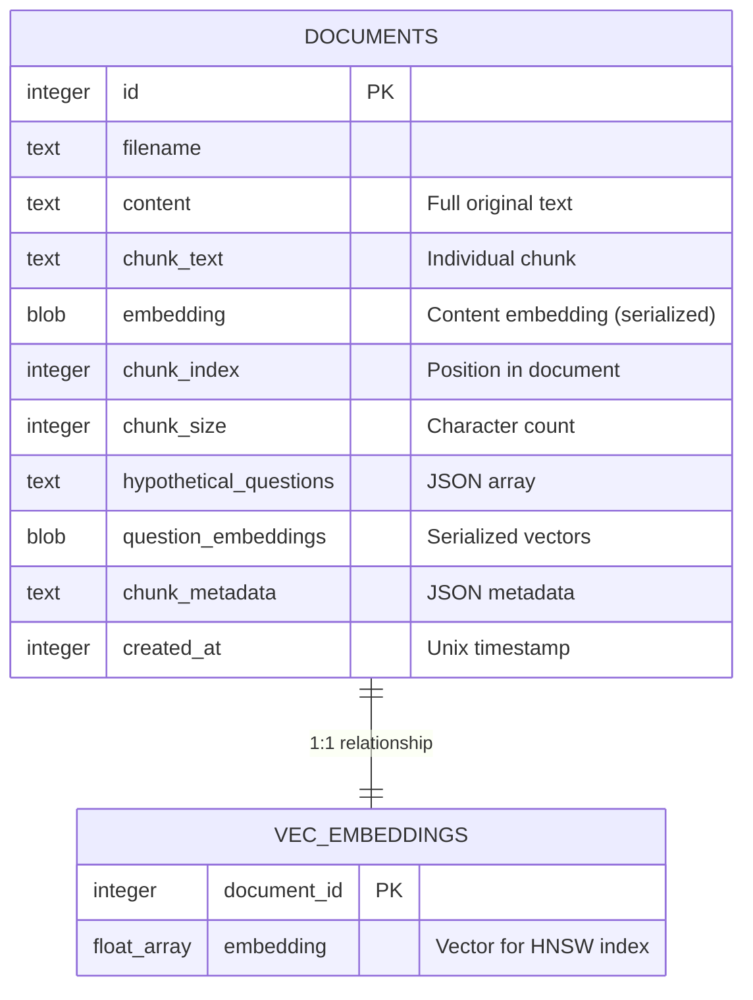

# RAG Application Architecture

## Overview

This is a **Retrieval-Augmented Generation (RAG)** system built with Bun runtime that enables semantic search and AI-powered question answering over document collections. The system ingests documents (PDF, CSV, TXT), converts them into vector embeddings, stores them in a SQLite database with vector search capabilities, and uses an LLM to generate contextually relevant answers.

## Key Technologies

- **Bun Runtime**: Modern JavaScript runtime with built-in SQLite, HTTP server, and fast bundler
- **sqlite-vec**: Vector similarity search extension with HNSW indexing for O(log n) performance
- **Transformers.js / AI SDK**: Flexible embedding and LLM provider support (local or remote)
- **React**: Frontend UI with streaming response support
- **Model Context Protocol (MCP)**: Integration with Claude Desktop

---

## High-Level System Architecture



---

## Data Ingestion Pipeline

The ingestion process transforms raw documents into searchable vector embeddings with enhanced metadata.



### Ingestion Details

**File Processing:**

- **PDF**: Extracted using `pdf-parse` library
- **CSV**: Intelligent schema detection for columns (title, content, link, collection, HTML, thesis)
- **TXT**: Direct text reading via `Bun.file`

**Text Chunking Strategies:**

- **Semantic Chunking**: Splits text at sentence boundaries while maintaining context (preferred)
- **Fixed-Size Chunking**: Splits into ~1000 character chunks with overlap
- **CSV Rows**: Each row processed separately; long rows are chunked

**Hypothetical Questions:**

- Generated for each chunk to improve retrieval accuracy
- Uses local LLM (Transformers.js) or remote API (AI SDK)
- Example: For a chunk about "vector databases", generates questions like "What is a vector database?" and "How do vector databases work?"
- These questions are embedded and stored alongside content embeddings

**Metadata Storage:**

- `chunk_index`: Position in original document
- `embedding_model`: Model version used (e.g., "Xenova/all-MiniLM-L6-v2")
- `chunking_strategy`: "semantic" or "fixed-size"
- `ingestion_date`: Timestamp
- CSV-specific: All original CSV fields preserved with `csv_` prefix

---

## Search & Retrieval Flow

The search system uses a **hybrid approach** combining content similarity and question matching for superior retrieval accuracy.



### Search Algorithm Details

**Vector Search (sqlite-vec):**

```sql
SELECT d.id, d.filename, d.chunk_text, d.question_embeddings, v.distance
FROM vec_embeddings v
INNER JOIN documents d ON v.document_id = d.id
WHERE v.embedding MATCH ? AND k = 2000
ORDER BY v.distance
```

**Why k=2000?**

- Higher candidate count ensures good recall after filtering
- Hybrid scoring, threshold filtering, and deduplication reduce final count
- HNSW index makes this efficient (O(log n) instead of O(n))

**Hybrid Scoring Formula:**

```
hybrid_score = (max_question_similarity × 0.7) + (content_similarity × 0.3)
```

**Why 70/30 weighting?**

- Questions are generated specifically to match user queries
- Content similarity alone misses semantic nuances
- This weighting provides best empirical results

**Deduplication:**

- Removes duplicate chunk_text (same content indexed multiple times)
- Keeps highest-scoring occurrence
- Prevents redundant results

---

## RAG Question-Answering Flow

The RAG system retrieves relevant context and uses an LLM to generate accurate, grounded answers.



### RAG Pipeline Details

**Step 1: Document Retrieval**

- Performs hybrid vector search (see Search Flow above)
- Default: Top 5 most relevant chunks
- Configurable similarity threshold (default: 0.5)

**Step 2: Context Building**

- Maximum context length: ~16,000 characters (configurable)
- Each chunk includes source citation for attribution
- Format:

  ```
  [Source 1: document.pdf, chunk 3]
  <chunk text>

  ---

  [Source 2: another.pdf, chunk 1]
  <chunk text>
  ```

**Step 3: LLM Prompting**

- **System Prompt**: Instructs LLM to answer based on provided context
- **Context**: Retrieved document chunks with citations
- **User Question**: Original question

Default System Prompt:

```
You are a helpful AI assistant. Answer the question based on the context provided.
Be concise, accurate, and cite sources when possible. If the context doesn't
contain enough information, say so.
```

**Step 4: Answer Generation**

_Non-Streaming Mode:_

- Waits for complete LLM response
- Returns answer + sources + timing info

_Streaming Mode (SSE):_

1. `sources` event: Relevant documents with similarity scores
2. `chunk` events: Text tokens as they're generated
3. `done` event: Completion timestamp

---

## Database Schema

The system uses SQLite with the sqlite-vec extension for efficient vector storage and retrieval.



### Schema Details

**documents Table:**

- Main storage for document chunks and metadata
- `embedding`: Serialized Float32Array as BLOB for JavaScript processing
- `question_embeddings`: Multiple vectors for hypothetical questions
- `chunk_metadata`: JSON with chunking strategy, model version, custom fields

**vec_embeddings Virtual Table:**

- Uses sqlite-vec's `vec0` virtual table type
- Automatically maintains HNSW index for fast KNN search
- Dimension count: 384 (Transformers.js) or 768 (AI SDK models)
- Enables `MATCH` operator for indexed search

**Indexes:**

- `idx_filename`: Fast lookup by document name
- `idx_chunk_index`: Fast ordering within documents
- HNSW vector index: Automatic in vec_embeddings

---

## API Endpoints

### HTTP API (Bun.serve)

The application exposes a REST API via Bun's built-in HTTP server:

| Endpoint      | Method | Description                           |
| ------------- | ------ | ------------------------------------- |
| `/`           | GET    | API information and document count    |
| `/ui`         | GET    | Web UI (React frontend)               |
| `/health`     | GET    | Health check with database status     |
| `/search`     | POST   | Semantic search for similar documents |
| `/ask`        | POST   | Ask a question (RAG, full response)   |
| `/ask/stream` | POST   | Ask a question (RAG, streaming SSE)   |

**Example `/search` Request:**

```json
{
  "query": "What is vector search?",
  "topK": 5,
  "similarityThreshold": 0.5
}
```

**Example `/ask` Request:**

```json
{
  "question": "How do embeddings work?",
  "topK": 5,
  "maxAnswerLength": 800,
  "systemPrompt": "Be concise and technical."
}
```

### MCP Server

The MCP (Model Context Protocol) server enables Claude Desktop integration:

**Available Tools:**

- `vector_search`: Search the vector database
- `vector_ask`: Ask questions with RAG
- `vector_status`: Get database status

Usage in Claude Desktop:

```json
{
  "mcpServers": {
    "bun-vector": {
      "command": "bun",
      "args": ["run", "mcp"],
      "cwd": "/path/to/bun-vector-mcp"
    }
  }
}
```

---

## Configuration

### Provider Types

The system supports two provider configurations:

**1. Transformers.js (Local Models)**

```typescript
PROVIDER_TYPE = 'transformers';
EMBEDDING_MODEL = 'Xenova/all-MiniLM-L6-v2'; // 384 dimensions
LLM_MODEL = 'Xenova/Qwen2.5-0.5B-Instruct';
```

**Benefits:**

- Fully offline operation
- No API costs
- Privacy-preserving
- Slower initial load (downloads models)

**2. AI SDK (OpenAI-Compatible APIs)**

```typescript
PROVIDER_TYPE = 'ai-sdk';
EMBEDDING_MODEL = 'text-embedding-3-small'; // 768 dimensions
LLM_MODEL = 'gpt-4o-mini';
AI_BASE_URL = 'https://api.openai.com/v1';
AI_API_KEY = 'sk-...';
```

**Benefits:**

- Fast inference
- No local model downloads
- Higher quality embeddings and generation
- Requires API access and credits

### RAG Parameters

**Chunking:**

- `CHUNK_SIZE`: 1000 characters (fixed-size mode)
- `CHUNK_OVERLAP`: 200 characters

**Search:**

- `DEFAULT_TOP_K`: 5 results
- `SIMILARITY_THRESHOLD`: 0.5 (50% similarity)
- `QUESTION_WEIGHT`: 0.7
- `CONTENT_WEIGHT`: 0.3

**Generation:**

- `MAX_ANSWER_TOKENS`: 800
- `GENERATION_TEMPERATURE`: 0.7
- `MAX_CONTEXT_LENGTH`: 16000 characters

---

## Performance Characteristics

### Search Performance

**Vector Index (sqlite-vec):**

- Algorithm: HNSW (Hierarchical Navigable Small World)
- Time Complexity: O(log n) for KNN search
- Space Complexity: ~1.5x embedding size (index overhead)

**Typical Search Times:**

- 10K documents: 10-30ms
- 100K documents: 20-50ms
- 1M documents: 40-100ms

_Note: Times vary based on hardware, embedding dimensions, and k value_

### Ingestion Performance

**Bottlenecks:**

1. PDF text extraction: ~1-5 seconds per document
2. Embedding generation:
   - Local: ~100ms per chunk (Transformers.js)
   - Remote: ~50ms per chunk (AI SDK with batching)
3. Question generation: ~200ms per chunk (local)

**Optimization Strategies:**

- Batch embedding generation (10 chunks at once)
- Caching for duplicate texts
- Parallel processing where possible

---

## Frontend Architecture

The web UI is built with React and uses Server-Sent Events (SSE) for streaming responses.

### Component Structure

```
App.tsx
├── QueryInput.tsx       # Search/ask mode switcher, input fields
├── ResponseDisplay.tsx  # Shows results/answers
├── SourcesList.tsx      # Displays source documents
└── ThemeToggle.tsx      # Dark/light mode switch
```

### Streaming Implementation

```typescript
// Client-side (useQuery hook)
const eventSource = new EventSource('/ask/stream', {
  method: 'POST',
  body: JSON.stringify({ question }),
});

eventSource.addEventListener('message', e => {
  const event = JSON.parse(e.data);

  if (event.type === 'sources') {
    setSources(event.sources);
  } else if (event.type === 'chunk') {
    setAnswer(prev => prev + event.text);
  } else if (event.type === 'done') {
    setIsLoading(false);
  }
});
```

---

## Deployment

### Running the Application

**Development (with HMR):**

```bash
bun --watch src/index.ts
```

**Production:**

```bash
bun src/index.ts
```

**Ingest Documents:**

```bash
bun src/scripts/feed.ts [source-directory]
```

**MCP Server:**

```bash
bun run mcp
```

### Environment Variables

```bash
# Provider configuration
PROVIDER_TYPE=ai-sdk           # or 'transformers'
EMBEDDING_MODEL=text-embedding-3-small
LLM_MODEL=gpt-4o-mini
AI_BASE_URL=https://api.openai.com/v1
AI_API_KEY=sk-...

# Database
DB_PATH=./vector.db

# MCP Mode
MCP_MODE=true                  # For MCP server only
```

---

## System Requirements

**For Transformers.js (Local):**

- 8GB+ RAM (models load into memory)
- Modern CPU (Apple Silicon recommended)
- 2GB+ disk space for model cache

**For AI SDK (Remote):**

- Stable internet connection
- API access (OpenAI, Anthropic, or compatible)
- Minimal local resources

**General:**

- Bun runtime (latest version)
- SQLite with extension support
- Node.js 18+ (for some dependencies)

---

## Key Design Decisions

### Why Hybrid Search?

Pure content similarity misses semantic nuances. By generating and embedding hypothetical questions, we capture the **intent** behind each chunk. This dramatically improves retrieval for natural language queries.

**Example:**

- Chunk: "Vector databases store embeddings as arrays of floating-point numbers."
- Generated Question: "How are embeddings stored in vector databases?"
- User Query: "embedding storage format"

The user query matches the question better than the raw content, leading to better retrieval.

### Why sqlite-vec?

- **Integrated**: No separate vector database service
- **Fast**: HNSW indexing provides near-instant search
- **Simple**: Single SQLite file for entire application state
- **Proven**: SQLite is battle-tested and reliable
- **Portable**: Database file can be copied/backed up easily

### Why Bun?

- **Fast**: Faster than Node.js for most operations
- **Integrated**: Built-in SQLite, HTTP server, bundler
- **Modern**: Native TypeScript support, top-level await
- **Simple**: Less configuration and tooling needed
- **HTML Imports**: Serve React directly from HTML without separate build step

---

## Future Enhancements

### Potential Improvements

1. **Multi-Vector Search**: Store multiple embeddings per chunk (different aspects)
2. **Re-ranking**: Use cross-encoder models to re-rank search results
3. **Query Expansion**: Automatically generate query variations
4. **Feedback Loop**: Learn from user interactions to improve retrieval
5. **Document Updates**: Handle document versioning and updates
6. **Access Control**: Add user authentication and document permissions
7. **Analytics**: Track popular queries and document usage
8. **Export**: Generate reports and summaries from document collection

### Scalability Considerations

**Current Limits:**

- Single SQLite file (~1TB theoretical max)
- In-memory embeddings during ingestion
- Single-threaded search (sqlite-vec limitation)

**For Large Scale:**

- Consider PostgreSQL with pgvector extension
- Implement distributed search (e.g., Qdrant, Weaviate)
- Add caching layer (Redis) for frequent queries
- Use message queue for async ingestion

---

## Troubleshooting

### Common Issues

**sqlite-vec extension not loading:**

- Solution: Install Homebrew SQLite: `brew install sqlite`
- Verify: Check logs for "Using Homebrew SQLite"

**Out of memory during ingestion:**

- Solution: Process files in smaller batches
- Reduce `CHUNK_SIZE` or use fixed-size chunking

**Slow search performance:**

- Check document count (may need database optimization)
- Reduce `topK` or increase `SIMILARITY_THRESHOLD`
- Ensure vec_embeddings index is built

**Poor answer quality:**

- Increase `topK` for more context
- Lower `SIMILARITY_THRESHOLD` to get more results
- Adjust system prompt for better instructions
- Try different embedding model (larger dimensions)

---

## Conclusion

This RAG system demonstrates a production-ready architecture for semantic search and question answering. By combining modern web technologies (Bun, React) with advanced AI techniques (embeddings, hybrid search, LLMs), it provides a powerful and flexible platform for working with document collections.

The modular design allows easy customization of embedding models, LLM providers, chunking strategies, and search algorithms, making it adaptable to a wide range of use cases from personal knowledge bases to enterprise documentation systems.
